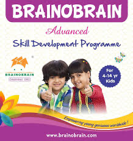

# 🧠 Brainobrain Regional Centers Portal



> **Live Website:** [https://brainobrain-regional-centers.vercel.app](https://brainobrain-regional-centers.vercel.app)

> **Empowering Young Minds in Bhavani, Mettur, and Anthiyur.**
> The official digital gateway for Brainobrain regional centers, dedicated to advanced skill development and cognitive training for children.

---

## 🌟 Overview

This repository hosts the source code for the regional website of **Brainobrain**, a world-class skill development programme for children. The platform serves as a central hub for parents and students in the **Erode and Salem districts**, providing information about our centers in **Bhavani**, **Mettur**, and **Anthiyur**.

Our mission is to nurture the hidden potential in every child through our 10-level Abacus & Skill Development Programme.

## 🚀 Key Features

*   **📍 Center Locator**: detailed information and maps for all regional centers.
*   **📱 Responsive Design**: A seamless experience across mobile, tablet, and desktop devices.
*   **🖼️ Dynamic Gallery**: Showcasing our vibrant classrooms and student activities.
*   **📞 Easy Contact**: Direct WhatsApp integration and contact forms for admissions.
*   **⚡ Modern Tech Stack**: Built for speed and performance.

## 🛠️ Technology Stack

This project is built using a modern frontend stack to ensure high performance and maintainability:

*   **Frontend Framework**: [React](https://react.dev/)
*   **Build Tool**: [Vite](https://vitejs.dev/)
*   **Language**: [TypeScript](https://www.typescriptlang.org/)
*   **Styling**: [Tailwind CSS](https://tailwindcss.com/)
*   **Icons**: [Lucide React](https://lucide.dev/)
*   **Animations**: [Framer Motion](https://www.framer.com/motion/)

### Backend

*   **Runtime**: [Python](https://www.python.org/)
*   **Framework**: [FastAPI](https://fastapi.tiangolo.com/)
*   **Server**: [Uvicorn](https://www.uvicorn.org/)
*   **Validation**: [Pydantic](https://docs.pydantic.dev/)

## 📂 Project Structure

```bash
brainobrain-website/
├── public/          # Static assets (images, icons)
├── src/
│   ├── components/  # Reusable UI components (Navbar, Gallery, etc.)
│   ├── data/        # Static data files (e.g., centersData.ts)
│   ├── pages/       # Page components for each route
│   └── lib/         # Utility functions
└── ...config files  # Vite, Tailwind, TypeScript configs
```

## 🚀 Getting Started

Follow these steps to set up the project locally on your machine.

### Prerequisites

*   [Node.js](https://nodejs.org/) (v18 or higher)
*   npm or yarn

### Installation

1.  **Clone the repository**
    ```bash
    git clone https://github.com/Daaksh05/brainobrain-regional-centers.git
    cd brainobrain-regional-centers
    ```

2.  **Install dependencies**
    ```bash
    npm install
    # or
    yarn install
    ```

3.  **Start the development server**
    ```bash
    npm run dev
    ```

4.  **Open your browser**
    Navigate to `http://localhost:5173` to view the application.

### Backend Setup (Optional)

If you want to run the backend API:

1.  **Navigate to the backend directory**
    ```bash
    cd backend
    ```

2.  **Create a virtual environment**
    ```bash
    python -m venv venv
    source venv/bin/activate  # On Windows: venv\Scripts\activate
    ```

3.  **Install requirements**
    ```bash
    pip install -r requirements.txt
    ```

4.  **Start the server**
    ```bash
    uvicorn main:app --reload
    ```
    The API will be available at `http://localhost:8000`.

## 🤝 Contributing

Contributions are welcome! If you have suggestions or improvements, please fork the repository and create a pull request.

1.  Fork the Project
2.  Create your Feature Branch (`git checkout -b feature/AmazingFeature`)
3.  Commit your Changes (`git commit -m 'Add some AmazingFeature'`)
4.  Push to the Branch (`git push origin feature/AmazingFeature`)
5.  Open a Pull Request

## 📞 Contact

For admissions and inquiries, refer to the contact details on the website or reach out to our centers directly.

---
*Built with ❤️ for the future generation.*
